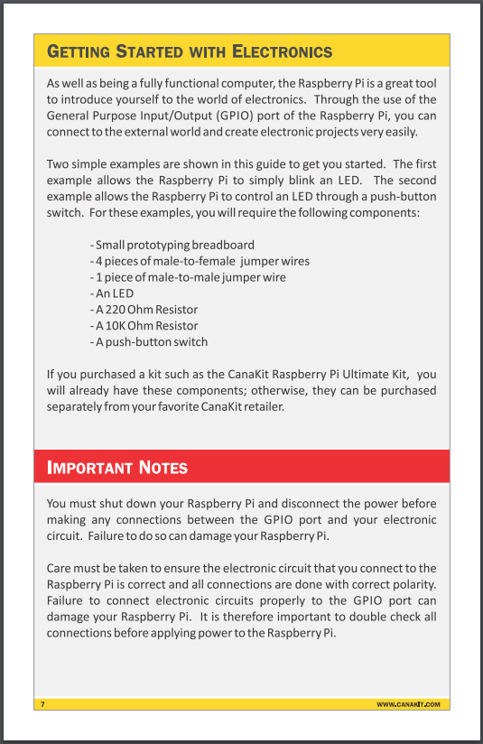
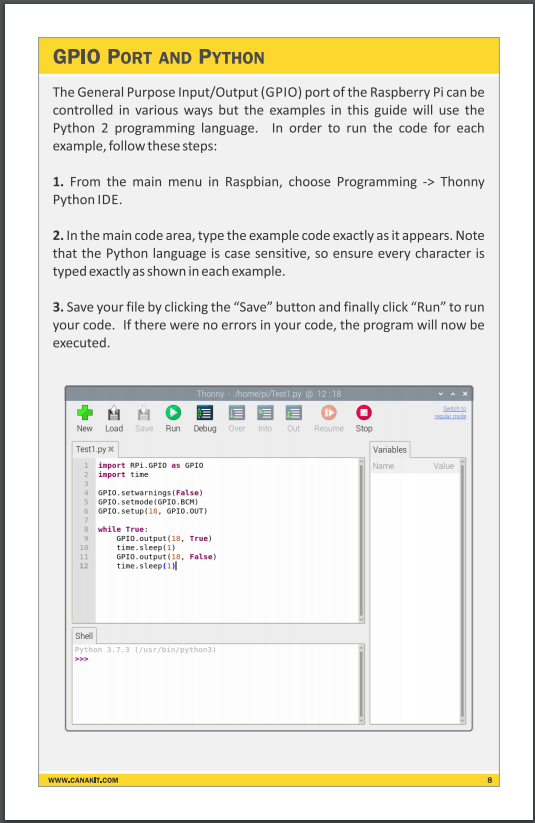
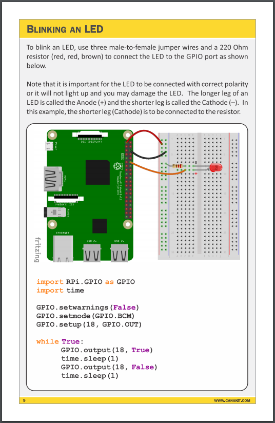

# Raspberry PI GPIO API

## quick-start







> https://www.canakit.com/Media/CanaKit-Raspberry-Pi-Quick-Start-Guide-4.0.pdf


## running the app

Install dependencies.
```
pip install -r app/requirements.txt
```

Start the app. The light should start blinking.
```
python app/index.py
```

## testing the app

Is the app listening?
```
curl localhost:5000/
```

Turn the light on and off with a delay.
```
curl localhost:5000/blink
```

Turn the light off.
```
curl localhost:5000/off
```

Turn the light on.
```
curl localhost:5000/on
```